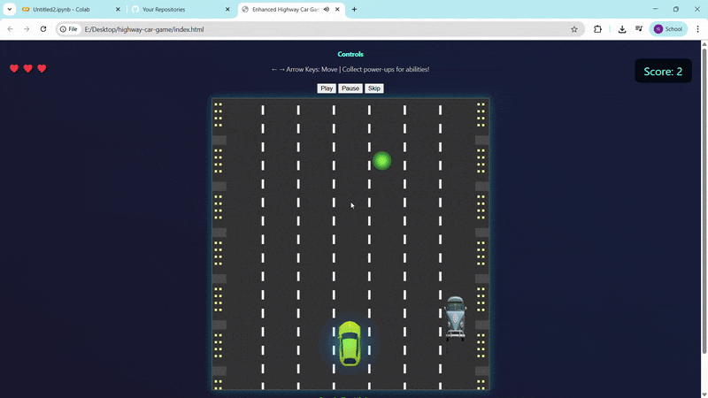

# 🚗 Highway Car Game

A fast-paced, arcade-style highway racing game built using **JavaScript**, **HTML5 Canvas**, and **CSS**. Dodge traffic, collect power-ups, and survive as long as possible on dynamically changing roads!

## 📁 Project Structure

---

## 🎮 How to Play

- Use **←** and **→** arrow keys to steer the car.
- **Collect power-ups**:
  - 🛡️ Shield – temporary invincibility
  - ⚡ Speed Boost – increases movement speed
- **Avoid enemy vehicles** – crashing ends the game.
- The environment and traffic get tougher as your score increases.

---

## 💻 How to Run

1. Clone or download this repository.
2. Open `index.html` in your browser.
3. No server required — it's a fully client-side game.

---

## 🔊 Audio Features

- Background music starts when the game begins.
- Available tracks:
  - `drive.mp3`
  - `sixdays.mp3`
- Music loops continuously. Controls allow play/pause/skip.

---

## 🛠️ Customization

- Add new enemies → place `.png` files in `images/` and update `game.js`.
- Add new tracks → place `.mp3` files in `audio/` and update `audio.js`.
- Adjust game difficulty → tweak `spawnEnemy()` logic in `game.js`.

---

## ✨ Features

- Smooth enemy spawn logic with random patterns
- Dynamic road types: city, snow, desert, night
- Power-ups: shields, speed boosts
- Particle effects and visual feedback
- Optimized for browser performance (FPS monitored)
- Restart option after game over

---

## 📌 Credits

Developed by **Vikas Raj**.  
Images and audio used are for educational/demo purposes. Please replace with licensed assets for public or commercial use.

---

## 🔐 License

This project is intended for educational and personal use.  
Do not redistribute or use commercially without replacing all third-party assets.
