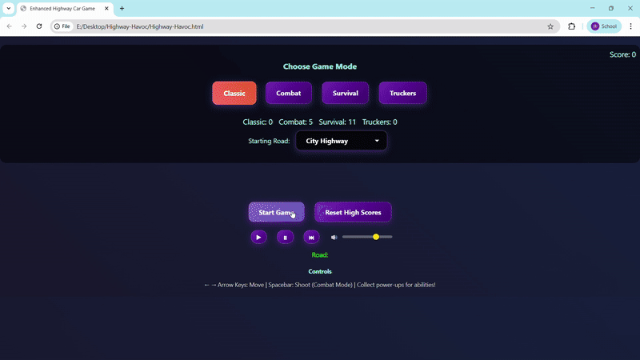
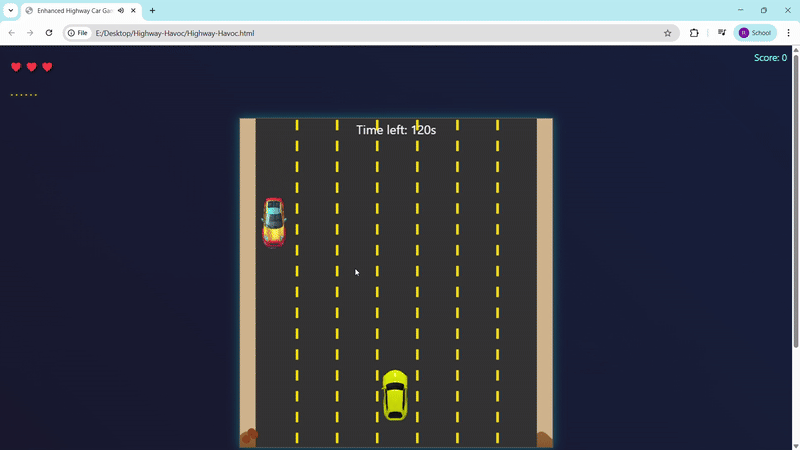

# 🚗 Highway Havoc

**Highway Havoc** is a fast-paced, browser-based arcade game built with **JavaScript**, **HTML5 Canvas**, and **CSS**. Choose from 4 unique modes — Classic, Combat, Survival, and Truck — and dominate the road with sharp reflexes, firepower, and power-ups!

---

## 🎮 Game Modes

### 1️⃣ Classic Mode

A pure endless runner. Dodge traffic and survive as long as you can. No enemies, no weapons — just skill and speed.

---

### 2️⃣ Combat Mode (2 Minutes)

Arm your car with **weapons** and blast through enemy vehicles while dodging traffic. Power-ups enhance your firepower and protection. Can you survive the chaos for 2 full minutes?

---

### 3️⃣ Survival Mode (2 Minutes)

Hold out for 2 minutes using limited lives and strategically timed **shields** and **boosts**. Enemies appear in clusters, and the road dynamically changes. The longer you survive, the harder it gets.

---

### 4️⃣ Truck Mode

Take control of a **massive truck** and **ram through enemies** instead of dodging them. This mode focuses on destruction rather than survival.

---

## 🔊 Music & Audio Features

- 🎵 Integrated background music and SFX
- 🎚️ Players can **play/pause/skip** tracks
- Audio handled via `audio.js`, tracks stored in `audio/` folder

---

## 🛠 Tech Stack

- HTML5 Canvas for graphics
- Vanilla JavaScript for logic
- CSS for animations and styling
- Modular JS files (`game.js`, `abilitiesAndLives.js`, etc.)

---

## 📁 Project Structure

Highway-Havoc/

│

├── index.html

├── game.js

├── abilitiesAndLives.js

├── audio.js

├── styles.css

│

├── images/

│ ├── player.png

│ ├── enemy1.png ... enemy7.png

│ ├── truck1.png, truck2.png

│ ├── gameplay-classic.gif

│ ├── gameplay-combat.gif

│ ├── gameplay-survival.gif

│ └── gameplay-truck.gif

│

├── audio/

│ ├── drive.mp3

│ └── sixdays.mp3

---

## 🧪 How to Run

1. Clone or download the repository.
2. Open `index.html` in your browser.
3. **No server setup needed.**

---

## 📌 Features

- 4 fully functional game modes
- Power-ups: Shield, Speed Boost
- Dynamic enemy spawn logic and road types
- Particle effects and audio integration
- Clean modular code and reusable components
- Game Over screen and restart support

---

## 📜 License & Credits

This project was created by **Vikas Raj** as part of a personal learning journey and academic challenge.  
All assets (images/audio) are used for educational purposes. Please replace them with your own licensed media for public/commercial deployment.

---

## 🙌 Contributions

PRs are welcome for:
- New game modes
- Mobile optimization
- Scoreboard & Highscore tracking

---

